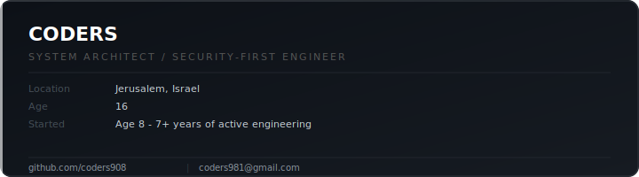

<div align="center">


</div>

<div align="center">

[](https://git.io/typing-svg)

</div>

<br/>

---

<div align="center">
  
</div>

---

## About

I started exploring the world of code at the **age of 8**. By 16, I had already shipped production systems and built robust full-stack platforms that serve real users under real load.

> I do not build side projects. I build **infrastructure**.

### Technical Philosophy
My approach starts from the metal - **low-level systems, binary analysis, and memory management** - and extends all the way up through backend architecture, cloud deployment, and full-stack delivery. 

### Security-First Mindset
Throughout every layer, I place a **heavy emphasis on security**. To me, security isn't just a checkbox in the workflow; it is the core foundation upon which everything else is designed.

> *16 years old. 7+ years engineering. This is not a hobby.*

---

## Stack

**Languages**


**Backend**


**Frontend**


**Databases**


**Infrastructure & Cloud**


**Low-Level & Security**


**API Integration**

I integrate with any API. REST, WebSocket, GraphQL, or proprietary - if it has a spec, I can wire it into a production system.


---

## Philosophy

> I do not write code that works. I design systems that survive.

| Principle | Application |
|---|---|
| Schema-First | Data architecture drives every downstream decision |
| Least-Privilege | RBAC scoped tightly at every layer |
| Defensive | Validation and rate-limiting at all system edges |
| Separation | Modular service layers, minimal coupling |
| Deployment-Ready | Docker, NGINX, and cloud config from day one |

---

## Low-Level & Reverse Engineering

`IDA Pro` &nbsp; `Ghidra` &nbsp; `x64dbg` &nbsp; `WinDbg` &nbsp; `C / C++` &nbsp; `Python`

Dynamic binary analysis - memory forensics - anti-tamper bypass - high-performance systems modules in C/C++ - custom security tooling in Python.

---

## GitHub Activity

<div align="center">


</div>

<div align="center">


</div>

<div align="center">


</div>

---

## Contact

```
> ping --target CODERS

  coders981@gmail.com          [email]
  github.com/coders908         [github]
  linkedin.com/in/[soon]       [linkedin - coming soon]
  website                      [coming soon]
```

<div align="center">


</div>


